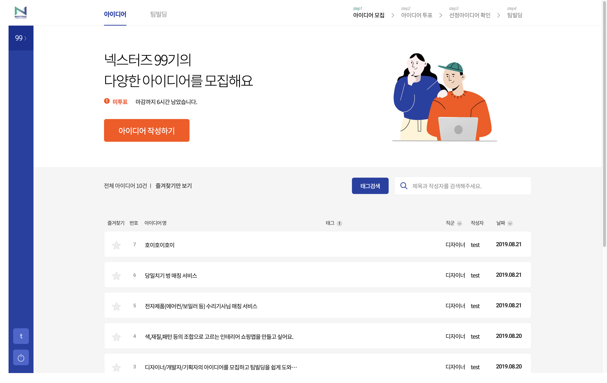
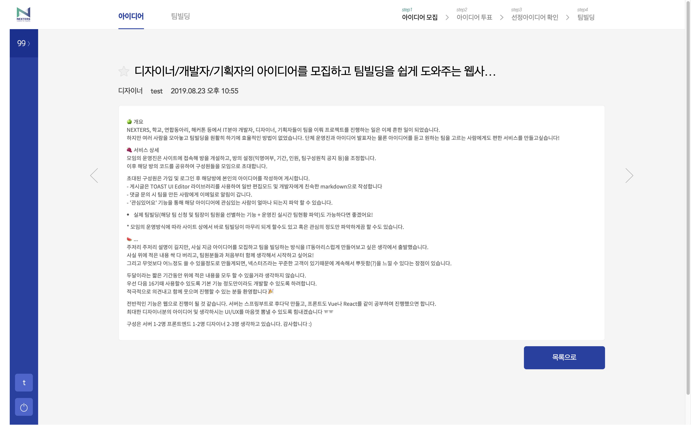
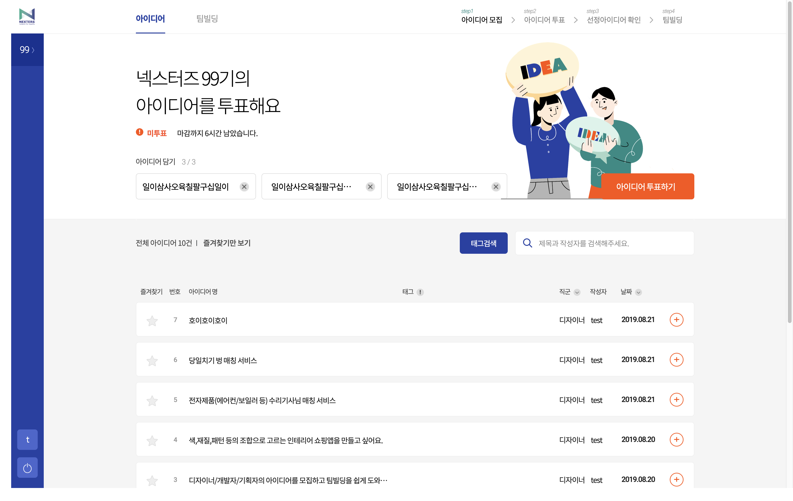
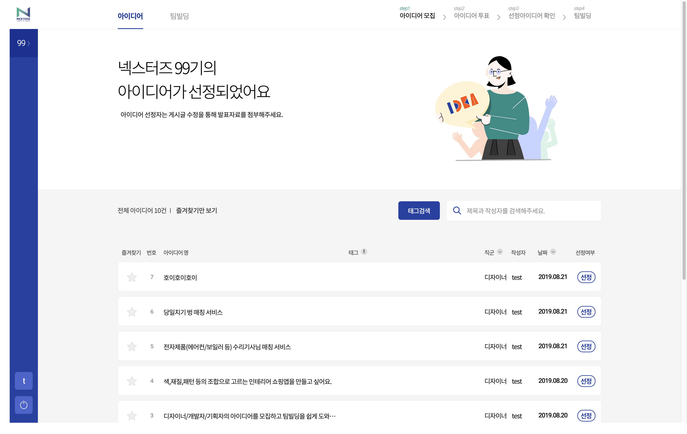

# 모임모임

[모임모임](http://www.모임모임.com)은 [넥스터즈](http://teamnexters.com/)의 아이디어를 아카이빙하고 팀빌딩을 할 수 있는 서비스입니다.

## 목차
1. [상세 기능](#detail)
2. [브랜치 관리 전략](#gitflow)
3. [TDD 수행 방법](#tdd)
4. [데모 화면](#screenshot)
5. [팀원 소개](#team)

## 상세 기능
실제 넥스터즈 팀빌딩 프로세스에 최적화된 설계

### 아이디어 관리
- 아이디어 모집 / 투표 / 선정
- 팀빌딩

### 사용성 향상
- 즐겨찾기
- 게시글 및 태그 검색

### 운영자 페이지
- 기수 설정
- 회원 관리
- 아이디어 관리

## 브랜치 관리 전략
- `master` : 제품으로 출시될 수 있는 브랜치
- `develop` : 다음 출시 버전을 개발하는 브랜치
- `feature` : 기능을 개발하는 브랜치
- `hotfix` : 버그를 수정하는 브랜치

모든 PR은 review 후에 자신이 `merge`합니다.

## TDD 수행 방법
### commit 전 검토 사항
- `gradle check`를 실행하고 test, checkstyle 문제점을 확인합니다.
- `gradle jacocoTestReport`를 실행하고 test coverage에서 빠진 부분이 있는지 확인합니다.

### Test
- gradle test - Test All Project

### Test Coverage
- gradle jacocoTestReport

## 데모 화면 

## 팀원 소개

넥스터즈 15기 (주)모임건설

### 디자이너
- [지니]()
- [혜니]()

### 프론트엔드 개발
- [team-builder-web](https://github.com/Nexters/team-builder-web)
- [미카엘](https://github.com/leekwanho)
- [봄](https://github.com/BBBOMi)
- [홈매튜](https://github.com/inhyuck)

### 서버 개발
- [team-builder-server](https://github.com/Nexters/team-builder-server)
- [오리진](https://github.com/Namkiwon)
- [도더니](https://github.com/sojeongw)
