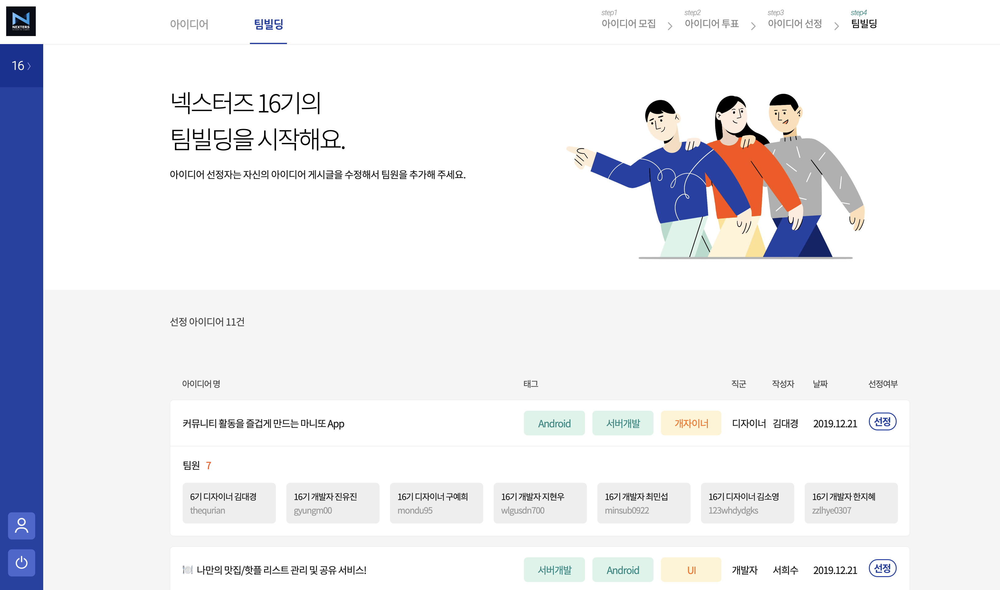

# 모임모임


> 모임모임은 [넥스터즈](http://teamnexters.com/) 회원들의 아이디어 제안부터 팀 빌딩까지의 과정을 외부 플랫폼 도움 없이 진행하기 위해 만든 서비스입니다.

<br/>

# ⚙️ 개발 환경


<br/><br/>

# 💿 프로젝트 시작

```shell script
# commit 전 검토 사항
./gradlew check                 # Test, CheckStyle 확인
./gradlew jacocoTestReport      # Test Coverage에서 빠진 부분이 있는지 확인

# 모든 테스트 수행
./gradlew test

# 프로젝트 빌드
./gradlew build

# 프로젝트 실행
./gradlew bootrun
```
<br/>

# 🌲 브랜치 관리 전략
- `master` : 제품으로 출시될 수 있는 브랜치
- `develop` : 다음 출시 버전을 개발하는 브랜치
- `feature` : 기능을 개발하는 브랜치
- `hotfix` : 버그를 수정하는 브랜치

모든 PR은 review 후에 자신이 `merge`합니다.
<br/><br/>

# 📑 상세 기능
## 회원가입 및 로그인


넥스터즈 회원 전용 서비스이므로 인증 코드를 입력하고 별도의 승인을 받아야 가입 및 이용이 가능합니다.
<br/><br/>

## 아이디어 목록


회원들이 작성한 아이디어를 열람, 필터링, 즐겨찾기 할 수 있습니다.
<br/><br/>

## 아이디어 투표 및 선정


투표 기간이 되면 마음에 드는 아이디어를 체크해서 투표할 수 있습니다.
<br/><br/>


투표 기간이 종료되면 선정된 아이디어를 확인할 수 있습니다.
<br/><br/>

## 팀 빌딩



팀 빌딩 당일에 협의를 통하여 팀원을 결정하고 목록에 추가합니다.
<br/><br/>

# 👨‍👩‍👧‍👦 프로젝트 멤버


넥스터즈 15기 (주)모임건설

## 디자이너

🧞‍️ 지니

💁‍ 혜니

## 클라이언트

🌸 봄 [(BBBOMi)](https://github.com/BBBOMi)

😇 미카엘 [(leekwanho)](https://github.com/leekwanho)

👑 홈매튜[(inhyuck)](https://github.com/inhyuck)

## 서버

🤐 오리진 [(Namkiwon)](https://github.com/Namkiwon)

🏃🏻‍️ 도더니 [(sojeongw)](https://github.com/sojeongw)
